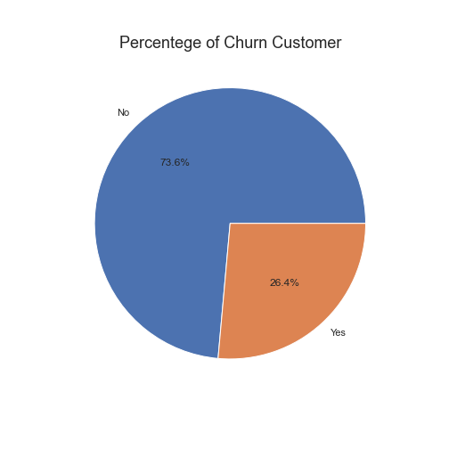
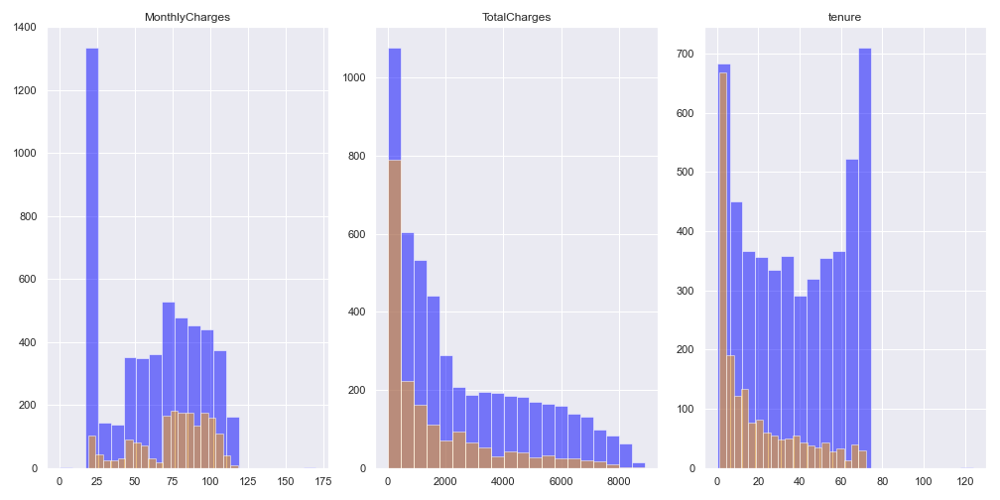
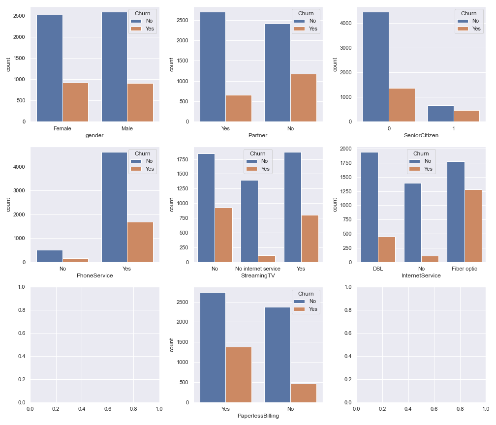
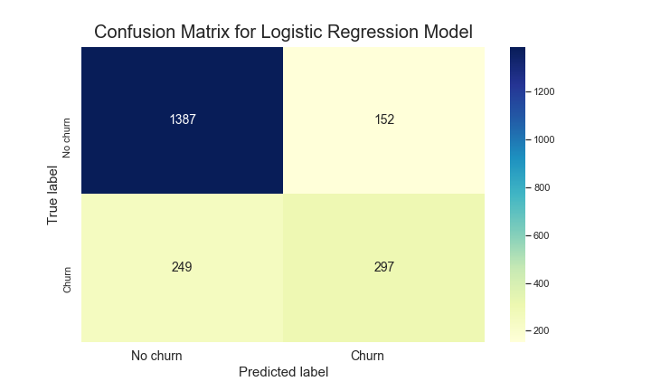
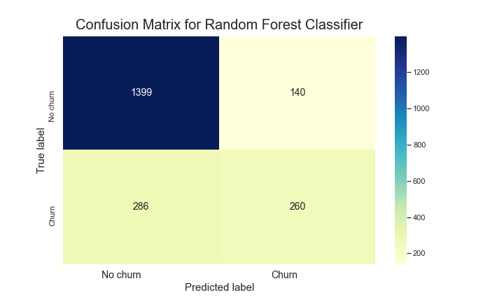
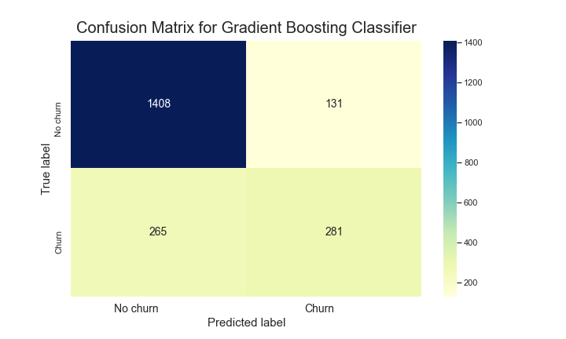
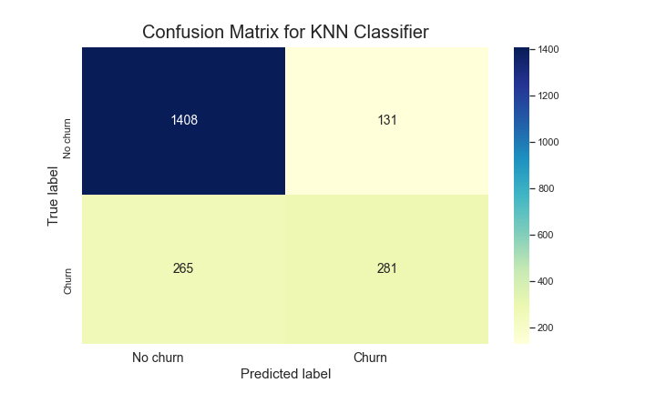

# Customer Churn Prediction using Machine Learning

- Nama : Rahmat Fajri
- Email : rfajri912@gmail.com
- [Portofoli](https://rfajri27.github.io/MyPortfolio/)

Dataset yang digunakan pada project ini merupakan dataset  **DQLab Telco**  dari salah satu modul project-based yang telah saya selesaikan di DQLab Academy.

## Data Cleansing
Langkah-langkah yang akan dilakukan adalah:
- Memfilter customerID (Nomor telphone) yang tidak valid dan menghilangkan duplikasi
- Mengatasi data-data yang memiliki *missing values* dengan metode *dropping* dan *imputation*
- Mengatasi outlier atau pencilan dengan menggunakan metode *interquartile range* (IQR)
- Menstandarisasi nilai dari variable

## Exploratory Data Analysis
### Percentege of Churn Customer



Berdasarkan plot tersebut dapat kita ketahui bahwa dari keseluruhan customer terdapat 26.4% customer yang melakukan *churn*.

### Exploring Numerical Columns



- Berdasarkan plot `MonthlyCharges` dapat kita ketahui bahwa semakin kecil biaya bulanan yang dikenakan, semakin kecil juga kecenderungan untuk melakukan *churn*
- Berdasarkan plot `TotalCharges` dapat dilihat bahwa tidak ada kecenderungan apapun terhadap *churn*
- Berdasarkan plot `tenure` dapat kita ketahui bahwa ada kecenderungan semakin lama berlangganan, semakin kecil kecenderungan untuk melakukan *churn*

### Exploring Categorical Columns



- Tidak ada perbedaan signifikan untuk melakukan *churn* jika dilihat faktor jenis kelamin (`gender`) dan layanan telfonnya (`PhoneSevice`)
- Ada kecenderungan melakukan *churn* untuk customer dengan kategori berikut:
    * Tidak memiliki partner (partner: No)
    * orang-orang yang statusnya adalah senior citizen (`SeniorCitizen: Yes`)
    * orang-orang yang mempunyai layanan streaming TV (`StreamingTV: Yes`)
    * orang-orang yang mempunyai layanan Internet (`internetService: Yes`)
    * orang-orang yang tagihannya paperless (`PaperlessBilling: Yes`)

## Data PreProcessing
- Menghapus columns yang tidak dibutuhkan dalam pembuatan model
- Melakukan encoding data untuk categorical data
- Mebagi dataset menjadi 70% data training dan 30% data testing

## Modeling
### Model: Logistic Regression

```
Classification Report Logistic Regression Model :
Accuracy:  0.808
Precesion:  0.544
Recall:  0.661
F1:  0.597
```



### Model: Random Forest Classifier

```
Classification Report Random Forest Classifier:
Accuracy:  0.798
Precesion:  0.476
Recall:  0.657
F1:  0.552
```



### Model: Gradient Boosting Classifier

```
Classification Report Gradient Boosting Classifier:
Accuracy:  0.81
Precesion:  0.515
Recall:  0.68
F1:  0.586
```



### Model: KNN Classifier

```
Classification Report KNN Classifier:
Accuracy:  0.81
Precesion:  0.515
Recall:  0.68
F1:  0.586
```




## Conclusion

- Dari keseluruhan customer terdapat 26.4% customer yang melakukan churn\
- Biaya bulanan memiliki pengaruh terhadap kecenderungan kustomer melakukan churn, dimana semakin kecil biaya bulanan yang dikenakan maka semakin kecil juga kecenderungan untuk melakukan churn. Selain itu, customer yang telah berlangganan dalam waktu yang lama memiliki kecenderungan yang kecil untuk melakukan churn.
- Ada kecenderungan melakukan *churn* untuk customer dengan kategori berikut:
    * Tidak memiliki partner (partner: No)
    * orang-orang yang statusnya adalah senior citizen (`SeniorCitizen: Yes`)
    * orang-orang yang mempunyai layanan streaming TV (`StreamingTV: Yes`)
    * orang-orang yang mempunyai layanan Internet (`internetService: Yes`)
    * orang-orang yang tagihannya paperless (`PaperlessBilling: Yes`)
- Berdasarkan pemodelan yang telah dilakukan dengan menggunakan empat jenis model yang berbeda, maka dapat disimpulkan untuk memprediksi churn customer dengan menggunakan dataset ini model terbaiknya adalah menggunakan algortima Logistic Regression.
